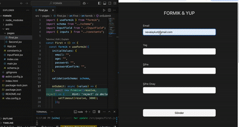

# 🧩 React Form Validasyon Projesi – Formik & Yup

Bu proje, React kullanarak modern form yapısının nasıl yönetileceğini ve doğrulama işlemlerinin nasıl yapılacağını göstermektedir. **Formik** ve **Yup** kütüphaneleri ile iki farklı yaklaşımla form tasarımı yapılmıştır:

- `useFormik` kullanımı
- `Formik`, `Field` ve `ErrorMessage` bileşenleriyle kullanım

## 🚀 Canlı Demo

> 

## 🛠 Kullanılan Teknolojiler

- [React]
- [Formik]
- [Yup]
- [Bootstrap]
- Custom CSS

## 📁 Klasör Yapısı

.
├── App.jsx
├── index.css
├── constants/index.js # Form alanlarını tanımlayan dizi
├── schema/index.js # Yup validasyon şeması
├── InputField.jsx # Reusable input bileşeni
└── pages/
├── First.jsx # useFormik yapısı ile form
└── Second.jsx # Formik bileşeni ile form

## 🧪 Özellikler

- ✅ Dinamik form alanları (`inputs` dizisi ile)
- ✍️ Reusable bileşen yapısı (`InputField`)
- 🔐 Güçlü şifre kontrolü (Regex ile)
- 🔄 Gerçek zamanlı hata yönetimi
- ⏳ Submit işlemi simüle edilmiş `3 saniyelik` gecikmeyle
- 🌗 Bootstrap ve özel CSS ile responsive & temiz arayüz

## 📌 Validasyon Kuralları (Yup)

- **Email:** Geçerli format ve zorunluluk
- **Yaş:** Min: 18, Max: 100, sadece tam sayı
- **Şifre:** En az 5 karakter, büyük-küçük harf, sayı ve özel karakter içermeli
- **Şifre Onayı:** Şifre ile birebir eşleşmeli

## 📦 Kurulum

1. Bu repoyu klonla:

git clone https://github.com/kullaniciadi/formik-yup-form.git
Klasöre gir ve bağımlılıkları yükle:

Kodu kopyala
cd formik-yup-form
npm install
Uygulamayı başlat:
Kodu kopyala
npm run dev
